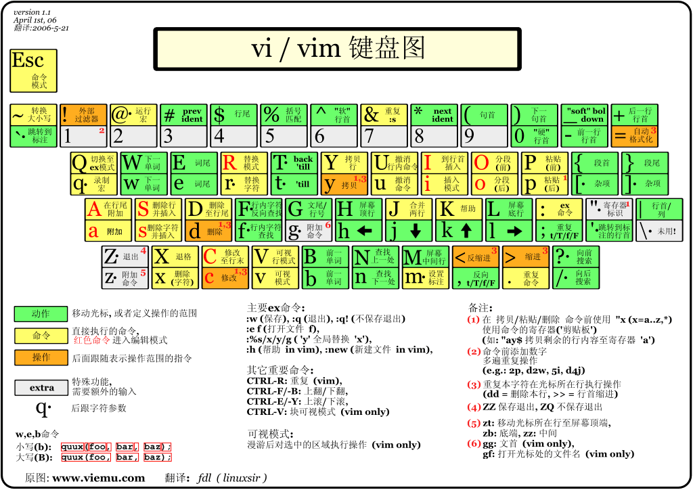
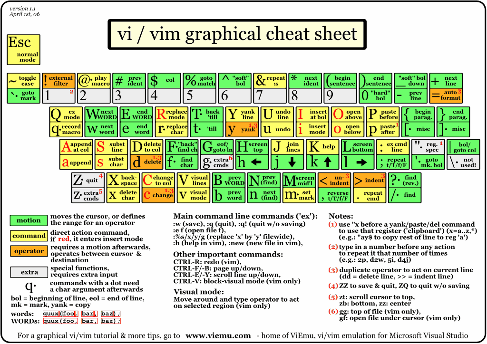

# Editor

## Vim

- [Vim实用技巧 PDF]({{ files_server }}/programming/basic-tools/editor/Vim实用技巧.pdf)
- 基于“模式化编辑”，键盘操作快到让人忘了鼠标存在。
- 体积极小，几乎所有类 Unix 系统自带。
- 熟练后速度极快，写代码像在玩乐器。
- 插件生态丰富，几乎可以无限扩展。

|  |  |
|:------------------:|:------------------:|
| Vim 键盘图     | Vim Graphics Cheat Sheet   |

---

## Neovim

- LazyVim
- Awesome Distribution
  - Lunarvim
  - SpaceVim
  - NvChad
  - AstroNvim
  - Onivim2

- 在 Vim 的基础上重构，更现代化，支持 Lua 配置。
- 内建异步 API，性能更强，插件开发更灵活。
- 更容易扩展、集成现代工具链。
- 社区活跃，新功能迭代快。

---

## Visual Studio

- 微软旗舰级 IDE，功能最全。
- 专为 .NET 和 C++ 等大型项目优化。
- 调试器功能极强，堪称业界标杆。
- 企业级支持，适合团队开发和大型工程。

---

## Visual Studio Code

- [Visual Studio Code 权威指南 PDF]({{ files_server }}/programming/basic-tools/editor/Visual%20Studio%20Code%20权威指南.pdf)
- 开源、跨平台，启动轻量但功能可通过插件无限扩展。
- 内建 Git 集成，前端、后端、运维都能用。
- 插件市场极其繁荣，可以快速变成 IDE。
- 跨平台体验统一，Windows、Linux、macOS 都好用。

---

## XCode

- 苹果官方 IDE，专为 iOS/macOS 开发设计。
- 自带模拟器、界面设计工具，集成度高。
- 写 Swift/Objective-C 的最佳环境。
- 与 Apple 生态完美结合，发布流程顺畅。

---

## Jetbrains

- [IntelliJ IDEA 中文文档]({{ files_server }}/programming/basic-tools/editor/IntelliJ%20IDEA%20中文文档.epub)
- [PyCharm 中文指南]({{ files_server }}/programming/basic-tools/editor/PyCharm%20中文指南.epub)
- 强大的代码分析和智能提示（IntelliSense 升级版）。
- 针对不同语言有专门 IDE（如 PyCharm、GoLand）。
- 重构工具极强，能安全快速地重构复杂代码。
- 对新手友好，能帮你发现潜在 Bug。

---

## More Choices

Emacs

- 模块化极强，几乎可以改造成一个小操作系统。
- 自带 Lisp 脚本语言扩展。
- 功能无限，能写代码、记笔记、发邮件。
- 高度可定制，是“黑客文化”的代表。

GNU Nano

- 命令行下的小巧编辑器，学习曲线低。
- 基本操作提示都在底部显示。
- 简单易用，适合初学者和快速改文件。
- 在服务器环境下极为常见，随时能用。

Zed

- 轻量极速，专注编辑体验，启动即用，无需繁琐配置。
- 内置现代协作功能，支持多人实时编辑。
- 界面简洁，响应流畅，专注代码而非配置。
- 现代化设计理念，强调效率与可扩展性，是“现代开发工具”的代表。

NotePad++

- 极轻量，打开快。
- 支持几十种语言高亮和正则查找替换。
- 免费开源，Windows 平台常备工具。
- 修改配置文件、脚本非常方便。

Sublime Text

- 启动速度极快。
- “多光标编辑”堪称神技。
- 界面简洁，专注写作/写代码。
- 可用插件拓展功能，但保持轻盈。
