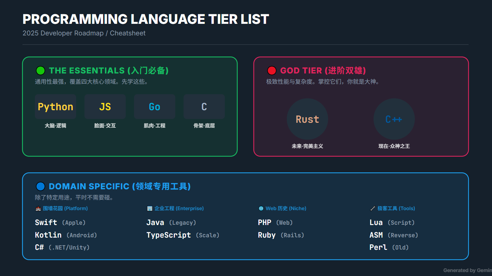

# Programming

## Projects

- [Awesome Cheatsheets](https://github.com/skywind3000/awesome-cheatsheets)
- [Learn X in Y minutes](https://learnxinyminutes.com/)

------

## Choose a language 

Getting Started

**1. Python** - ★★★★★

- 语法简洁，易于学习，适合初学者。
- 广泛应用于数据科学、人工智能、Web开发和自动化脚本。
- 丰富的库和框架，如Django（Web开发）、Pandas（数据分析）、TensorFlow（深度学习）。
- **适合人群**：初学者、数据科学家、全栈开发者。
- **趋势**：AI和数据领域持续增长，Python需求稳定。

**2. C** - ★★★★☆

- 系统级语言的鼻祖，几乎所有现代操作系统和嵌入式系统都以C为基础。
- 极高性能，接近硬件，适合深入学习计算机底层。
- **适合人群**：想从事操作系统、嵌入式开发的开发者。
- **趋势**：经典语言，需求稳定，但相对基础。

**3. JavaScript / TypeScript** - ★★★★★

- JavaScript是前端开发的必备语言，TypeScript在此基础上增加了类型支持。
- 广泛用于Web前端开发（React、Vue）、后端（Node.js）和全栈开发。
- 生态强大，几乎所有现代Web应用都离不开。
- **适合人群**：想从事Web开发的初学者或全栈开发者。
- **趋势**：Web和移动应用需求旺盛，TypeScript正在成为主流。

**4. Go (Golang)** - ★★★★★

- 简洁、高效，适合并发编程和分布式系统开发。
- 在云计算、微服务领域（如Kubernetes、Docker）需求旺盛。
- 学习曲线相对较低。
- **适合人群**：想进入云原生领域的开发者。
- **趋势**：Go是云计算和后端开发的热门选择，需求稳定增长。

Advanced

**1. Rust** - ★★★★★

- 安全性高（内存安全）、性能接近C++，但避免了许多传统系统语言的陷阱。
- 应用广泛：操作系统、WebAssembly、分布式系统、区块链等。
- 学习资源丰富，社区友好。
- **适合人群**：有编程基础且想深入学习底层开发的开发者。
- **趋势**：被广泛认为是现代系统编程的未来，需求增长迅速。

**2. C++** - ★★★★☆

- 功能强大，支持高性能开发，广泛应用于游戏、图形处理、分布式系统。
- 提供面向对象编程和泛型编程支持。
- **适合人群**：对性能和底层理解要求高的开发者。
- **趋势**：需求稳定，但学习曲线陡峭，逐渐被Rust取代部分市场。

------

## Programming Paradigm

- 过程式（Imperative/Procedural）
- 面向对象（OOP）
- 函数式（Functional）
- 通用编程 (General)
- 逻辑/声明式（Declarative/Logic）
- 面向切面（AOP）
- 数据流/反应式（Dataflow/Reactive）
- 并发/Actor 式（Concurrent/Actor）

------

## OOP

1: 企业级应用是 OOP 的主战场

- **典型语言/技术栈**：Java、C#、Python（面向对象风格）、Spring、.NET
  
- **典型场景**：ERP、CRM、金融系统、保险、电信后台
  
- **原因**：
  
  - 复杂业务建模：类和对象可以直观映射业务实体和流程
    
  - 长期维护需求：封装、多态、继承帮助代码模块化和可扩展
    
  - 团队协作：统一的 OOP 设计规范方便大型团队协作
    

2: OOP 很少出现的领域

| 领域  | 主流范式 | OOP 使用情况 |
| --- | --- | --- |
| 操作系统内核 | 过程式 + 模块化 | 几乎没有 |
| 数据库/缓存 | 过程式 + 数据驱动 | 很少  |
| 高性能服务器（Nginx、Redis） | 事件驱动/过程式 | 几乎没有 |
| 云原生/容器/编排（Docker、K8s） | 数据驱动 + 组合接口 | OOP 成分有限 |
| 前端现代框架（React/Vue） | 函数式 + 组合模式 | OOP 少数历史遗留 |
| 数据科学/AI | 函数式/脚本式 | OOP 很少 |

✅ **结论**：

- 企业级应用 → OOP 占多数
  
- 其他几乎所有领域 → OOP 占少数甚至几乎没有
  

3: 为什么 OOP 在其他领域不适用

1. **性能敏感** → OOP 的动态分派、继承、多态带来的开销不划算
  
2. **高度并发/分布式系统** → 数据驱动和组合模式更自然
  
3. **简单/短期逻辑** → 过度 OOP 会增加复杂度
  
4. **函数式风格更适合流式处理、事件驱动和 UI 组件化**

------

## Practicality Classification

Dynamic Language (Python、JavaScript)

- 优势：快速开发，灵活，生态丰富，适合原型、数据处理、Web开发等。
- 局限：无法直接操作底层硬件或构建操作系统、驱动、嵌入式系统。性能相对低，不能胜任高性能基础设施或系统级编程。

Static Language (Java、Go、C#)

- 优势：类型安全，适合构建大规模应用、后端服务、企业系统。
- 局限：开发速度比动态语言慢。不擅长直接控制底层硬件或操作系统。对快速迭代和临时脚本化任务不如动态语言方便。

System Level Language (C、C++、Rust)

- 优势：精确控制内存、CPU、硬件，构建操作系统、驱动、嵌入式系统。高性能，适合对效率要求极高的应用。
- 局限：开发复杂度高，迭代慢，不适合快速交付或原型开发。学习曲线陡峭。

Functional Language (Haskell、OCaml、Erlang)

- 优势：函数为一等公民、不可变数据、易并发和数学建模；学术研究、编译器开发、金融建模；科学计算、编译器；高并发分布式系统；数据处理、DSL、Web后台
- 局限：函数式语言优势突出于抽象、安全和并发，但局限在性能开销大、学习曲线陡峭、调试复杂及与现有生态集成困难。

Summary

- Python/Java → 快速开发，但不能做基础设施或系统级任务，换句话说就是应用层语言。
- C/C++ → 高性能基础设施，但迭代慢，不适合快速开发。

------

## Metaprogramming

- **普通编程**：你写代码，让程序做某件事（比如加法、排序、处理数据）。
  
- **元编程**：你写的代码不是直接做事，而是操纵“程序本身”去生成、修改或扩展逻辑。
  
  - 换句话说，它是“编程的编程”，程序可以在运行时或编译时动态生成新的代码、方法或行为。

例子帮助理解：

1. **Python 动态生成类**
  
  - 你不手动写每个类，而是用一个函数或 `type()` 自动生成 N 个类，每个类有不同的方法或属性。
2. **AOP / 装饰器**
  
  - 你写一个装饰器（元编程）来在函数执行前后插入逻辑，而不是修改函数本身。
3. **模板/宏**（C/C++ 或 Lisp）
  
  - 编译器在编译阶段用元编程生成不同版本的函数或代码块。

使用频率与领域

| 场景  | 使用频率 | 举例  |
| --- | --- | --- |
| **框架和库开发** | 高   | Spring、Django ORM、Hibernate、React 的 Hooks 实现、依赖注入容器 |
| **企业应用开发** | 中   | AOP（事务、日志、权限）、动态代理、反射用于通用工具 |
| **普通应用程序** | 低   | 一般业务代码写逻辑，不需要动态生成类或方法 |
| **性能敏感核心系统** | 很低  | 内核、数据库、Redis、Nginx 主要用过程式，元编程开销大 |